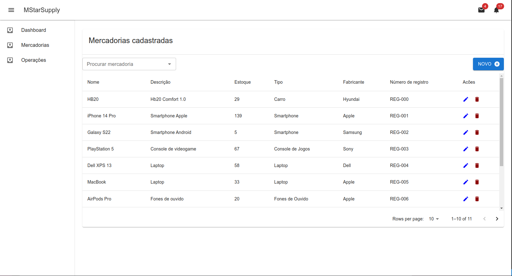

 
  <h1 align="center">MStarSupply</h1>

O projeto visa fornecer uma solução para a gestão de mercadorias, permitindo o controle de entradas e saídas, além do registro detalhado de cada item. O sistema inclui ferramentas para realizar análises gráficas, oferecendo insights visuais sobre o fluxo de mercadorias ao longo do tempo, auxiliando na tomada de decisões estratégicas e no monitoramento de estoque.

  
  
  

  
  
  
  
  

### Dependencies

### backend

| python | flask  | postgres

### frontend
| javascript |  react js   |

### DevOps
| docker 

### Rotas

#### Rotas de mercadoria
* GET - `/mercadoria` - Lista as mercadorias cadastradas
* POST - `/mercadoria` - Cadastra uma nova mercadoria
* PUT - `/mercadoria/{id}` - Atualiza uma mercadoria a partir do id
* DELETE - `/mercadoria/{id}` - Deleta uma mercadoria a partir do id
* GET - `/mercadoria/{id}` - Busca uma mercadoria a partir do id
  
#### Rotas de operações de entrada e saída de mercadoria
* GET - `/operacao` - Lista todas as operações de entrada e saída
* POST - `/operacao` - Cadastra uma nova operação de entrada ou saída 
* GET - `/operacao/totais` - Lista todas as operaçoes por mercadorias
* GET - `/operacao/mes/{id}` - Lista um histórico de operações de todos os meses de uma mercadoria 
  

### Run

Após preparar seu ambiente e seu virtualenv, siga os passos:

Obs: é necessário ter docker e docker compose instalados na máquina

#### Clone o projeto e execute os comandos abaixo
* `cd MStarSupply`
* `docker compose up`
